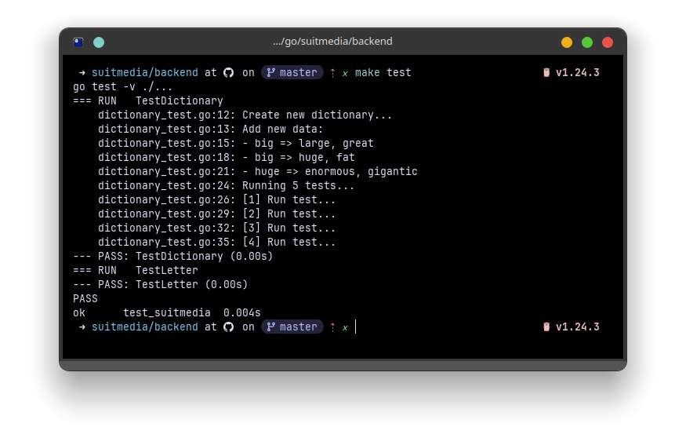

# TEST Magang Berdampak Suitmedia

Name: Muhamad Rizal Arfiyan

## How to run

Follow these steps to run the project:

1. **Clone the repository:**

   ```bash
   git clone https://github.com/rizalarfiyan/mber-suitmedia
   ```

2. **Navigate to the backend directory:**

   ```bash
   cd mber-suitmedia/backend
   ```

3. **Tidy Go modules (optional):**

   ```bash
   make tidy
   ```

   Or if `make` is not available:

   ```bash
   go mod tidy
   ```

4. **Run unit tests:**
   You can use either of the following commands:

   ```bash
   make test
   ```

   Or:

   ```bash
   go test -v ./...
   ```

## Test case


1. Test dictionary: [https://ideone.com/tWB0el](https://ideone.com/tWB0el)
2. Test letter: [https://ideone.com/goTeSf](https://ideone.com/goTeSf)